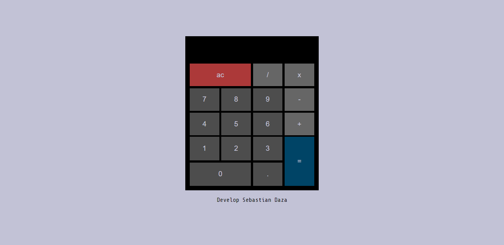

<h1 align="center">Login with PHP</h1>

<div align="center">
  <h3>
    <a href="https://calculator-sebas.netlify.app/">
      Demo
    </a>
    <span> | </span>
    <a href="https://{[Repo](https://github.com/SebasttianDaza/Calculator-React)}">
      Solution
    </a>
    <span> | </span>
    <a href="https://emprendeyourlifestyle.com/portafolio/">
      Website
    </a>
  </h3>
</div>

<p align="center">
  <br>
  
  <br>
</p>

<!-- TABLE OF CONTENTS -->

## Table of Contents

- [Table of Contents](#table-of-contents)
- [Overview](#overview)
  - [Built With](#built-with)
- [How To Use](#how-to-use)
- [Contact](#contact)

<!-- OVERVIEW -->

## Overview


Website is on state to deployed on Netlify. It's done with different technologies, but the main one is React, also it has the styles with SASS, and handle useContext to has the global state and differents custom hooks.

### Built With

<!-- This section should list any major frameworks that you built your project using. Here are a few examples.-->

- [React](https://reactjs.org/)
- [CSS](https://vuejs.org/)
- [Vercel](https://tailwindcss.com/)
- [React Icons](https://react-icons.netlify.com/)
- [Vite](https://vitejs.dev/)
- [SASS](https://sass-lang.com/)
- [Context API](https://reactjs.org/docs/context.html)


## How To Use

<!-- Example: -->

To clone and run this application, you'll need [Git](https://git-scm.com) and [Node.js](https://nodejs.org/en/download/) (which comes with [npm](http://npmjs.com)) installed on your computer. From your command line:

```bash
# Clone this repository
$ git clone https://github.com/your-user-name/your-project-name

# Install dependencies
$ npm install
$ composer install

# Run the app, you can use nginx or apache
```

## Contact

- Website [emprendeyourlifestyle.com](https://emprendeyourlifestyle.com/)
- GitHub [@SebasttianDaza](https://github.com/SebasttianDaza)
- Twitter [@SebasttianDaza](https://twitter.com/SebasttianDaza)